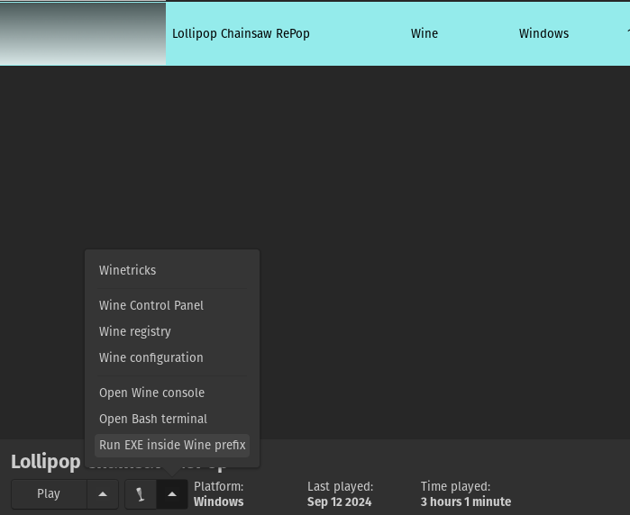
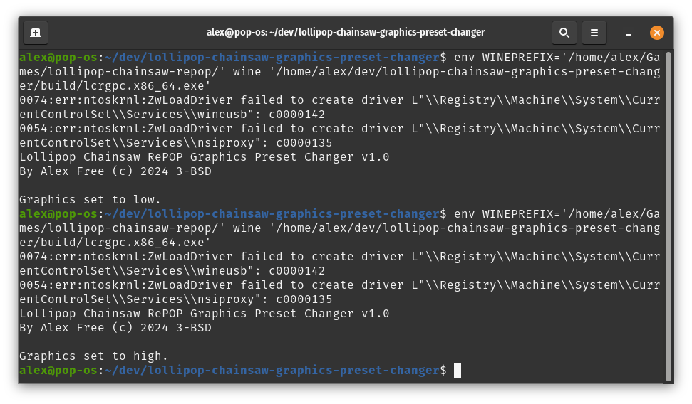

# Lollipop Chainsaw RePOP Graphics Preset Changer (LCRGPC)

_By Alex Free_.

Change the graphics quality from high (the default) to low and vice versa for the game Lollipop Chainsaw RePOP.

This game was released on September 12th 2024, after many delays. Said delays did not stop the game from shipping without a way to change the graphics quality preset. Without a menu option for changing the graphics quality, the developers decided it best to put the highest graphical quality options on as the default. So even though this is a remaster of a game released in 2012, it ran at a single digit FPS on my system. So I decided to write the graphics preset changer to add the missing functionality and make the game playable for me.

| [Homepage](https://alex-free.github.io/lcrgpc) | [Github](https://github.com/alex-free/lollipop-chainsaw-repop-graphics-preset-changer) |

## Table Of Contents

*   [Downloads](#downloads)
*   [Usage](#usage)
*   [License](#license)
*   [Credits](#credits)
*   [Building](build.md)

## Downloads

### Version 1.0 (9/14/2024)

Changes:

* Initial release.

----------------------------------------------------

*	[lcrgpc-v1.0-windows-x86\_64-static.zip](https://github.com/alex-free/lollipop-chainsaw-repop-graphics-preset-changer/releases/download/v1.0/lcrgpc-v1.0-windows-x86_64-static.zip) _Portable Release For x86_64 Windows (64 bit)_

---------------------------------------

## Usage

_For Windows Users_

Execute `lcrgpc.exe` from the downloaded release. It will set the graphics quality preset to low if it detects high settings (the default shipped with the game). It can be ran again to set the graphics preset to high (it checks if the current graphics quality preset is low quality).

_For Linux users using Lutris:_

1) Open Lutris
2) Click the game.
3) Cick the up arrow symbol at the bottom of the window and then click `Run EXE inside Wine prefix`.
4) Select the `lcrgpc.exe` file from the downloaded release.

_For Linux users using the command line_

`Usage:`

`env WINEPREFIX=<your wine prefix> <your wine executable> <lcrgpc.exe>`

Example:

`env WINEPREFIX='/home/alex/Games/lollipop-chainsaw-repop/' wine '/home/alex/dev/lollipop-chainsaw-graphics-preset-changer/build/lcrgpc.x86_64.exe'` 

_Notes:_

* In addition to using LCRGPC, lowering the resolution can increase performance.

* There is information displayed when running lcrgpc.exe from the command line.

## License

Lollipop Chainsaw Graphics Preset Changer (LCRGPC) is open source software released under the 3-BSD license. Please see the file [license.md](license.md) for more information.

## Credits

This reddit post [You can run Lollipop Chainsaw RePop at 60 fps by changing the ini files](https://www.reddit.com/r/SteamDeck/comments/1ff8n4s/you_can_run_lollipop_chainsaw_repop_at_60_fps_by/).